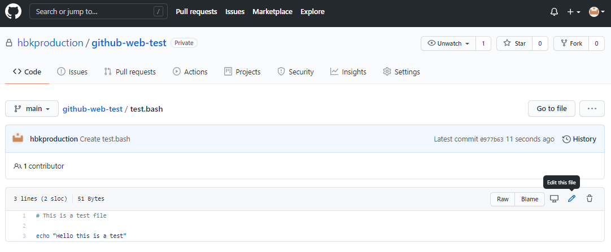
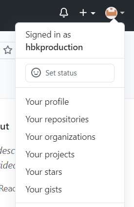

| Organization | Course | Exercise | Semester | Professor | T.A. | 
| --- | --- | --- | --- | --- | --- |
| Seoul National University | Introduction to Bioinformatics | Bash introduction #1 | Spring 2023 | Asst. Prof. M. Steinegger (martin.steinegger@snu.ac.kr) | Luna Jang (jse9512@snu.ac.kr) <br /> Rachel Kim (eunbelivable@snu.ac.kr)|

# How-to Guides

## Setup
We recommend to use google cloud shell editor if you don't have any bash environment available.<br>
If you want to use your local environment, you can always use yours but<br>
[**docker**](https://www.docker.com/get-started) must be pre-installed and available for setting dependencies.

About cloud shell editor, see [CloudShellEditor section](#CloudShellEditor).

If you open the terminal, please clone this repository to your working directory
and change the current directory to the cloned directory.
```sh
git clone <GITHUB_REPOSITORY_LINK>
cd ./<GITHUB_REPOSITORY_NAME>
```
After cloning, execute "setup.sh"
```sh
./setup.sh
```
If "setup.sh" executed well, you can see the username changed to "exercise01".
The copied repository is at "~/exercise01" and please work within this directory.

## Execution
Please write your commands to commandXX.sh and submit the whole repository by pushing the repository.<br> 
You can run your all "commandXX.sh" files with "main.sh" or run independently.
- Run with main.sh
    ```sh
    bash ./main.sh
    ```
- Run commandXX.sh independently
    ```sh
    bash ./command/commandXX.sh
    ```
- Hint:
  - Use 'chmod' when you meet a 'Permission denied' message.

## Submission
To submit your result, follow these steps:

- Step 1. Write your commands in commandXX.sh in the "command" directory
- Step 2. Save the result in the "result" directory. Save file as ./result/resultXX_X.txt or ./result/resultXX_X.csv
    > "." is relative path for current working directory and "./result/" is the directory named "result" in the current directory.   

    > To save outcome as a file, you may use redirection to files.
- Step 3. Add edited files to git and commit. You can use the commands below or GUI of cloud shell editor.
    ```sh
    # Tell git who you are.
    git config --global user.email "you@example.com"
    git config --global user.name "Your Name"
    # Update the change.
    git add path-of-updated-file # Do it for each updated file.
    git commit -m "Initial commit" # The message can be changed as you want.
    ```
- Step 4. Submit your answers by pushing the cloned repository.
    ```sh
    git push origin master # If master is not working, try "git push origin main"
    ```
    You may need to enter your github ID and password in this step.<br>
    > Caution: for password, you should use token.

### Submission on github interface
If you have problems with using git, you can use the interface of github.
You can edit commandXX.sh or resultXX.txt directly in the github repository web site as follows:
- Step 1. Click a file to edit and click the pencil icon at the top right corner. 
  When you hover the cursor over the icon, you will see the phrase "Edit this file". 
  
- Step 2. Edit the file with the text editor and click the green button with "Commit changes".
  

You can submit your result multiple times and the last version before the deadline will be graded.

---

# Exercise 01: Bash introduction #1

The goal of this exercise is to improve skills working with basic bash commands
in UNIX environment.

> Commands to learn
> wget, gzip, mkdir, mv, cd, ls, grep, wc, head, cat, pipe "|"<br>
Please write your commands in commandXX.sh and save your result to resultXX.txt (or resultXX.csv)

## command01.sh
1. Print your student number and github ID and copy the printed result to **student_id.txt**.
The format should be like "2021-#####,harryporter" without ".
    > You can check your github ID at the top right corner of the github page.
    
2. Download the fasta file with NCBI accession. The downloaded file should be named like "NC_XXXXXX.X.fasta" (No result file)
- Sequence name: Saccharomyces cerevisiae S288C chromosome I, complete sequence
- NCBI accession number: NC_001133.9
- Download link:
    - http://eutils.ncbi.nlm.nih.gov/entrez/eutils/efetch.fcgi?db=nucleotide&id=NC_001133.9&rettype=fasta
- Hint
  - You can avoid parsing error by embracing the link with " ". 
  - The name of the downloaded will be not proper : use -O option (search its usage)

## command02.sh
- Sequence name: Saccharomyces cerevisiae S288C chromosome I, complete sequence
- NCBI accession number: NC_001133.9
- Download link:
    - http://eutils.ncbi.nlm.nih.gov/entrez/eutils/efetch.fcgi?db=nucleotide&id=NC_001133.9&rettype=fasta

2. Print the list of files inside the data directory and copy the printed result to **result02.txt**.

## command03.sh
1. Print first 7 lines of the downloaded fasta file and copy the printed result to **result03_1.txt**.
2. Print last 5 lines of the downloaded fasta file and copy the printed result to **result03_2.txt**.
   - If the last line of the downloaded fasta file is blank, included it.  
4. Print from line 502 to line 525 (24 lines) of the downloaded fasta file and copy the printed result to **result03_3.txt**.

## command04.sh
1. How many lines are in this fasta file except for the header line? (The header lines start with ">".)
Write the number of lines except header lines to **result04_1.txt**.

2. How many DNA sequence lines (excluding header) of this fasta file 'not' containing "ATATA"?
Write the number of lines not containing "ATATA" to **result04_2.txt**.

3. From the fasta file, print the first 5 lines containing "GCTTC" and save the result to **result04_3.txt**.


## command05.sh
1. Restriction enzymes cut DNA by acting only on certain motifs (motif means specific sequences of bases).
EcoRI is a well-known restriction enzyme from *E. coli* and is used in various molecular genetics techniques. 
Identify the motif of EcoRI by searching online, get the number of motifs in the fasta file and save the number to **result05_1.txt**.
    > EcoRI motif consists of 6 bases.
    > Don't consider the sites split by the new line character - just count the sites fully contained in a line.
2. Another restiction enzyme, HincII from *Haemophilus influenzae* recognizes a specific nucleotide pattern like this:

    

    Save the number of HincII recognition sites in the fasta file to **result05_2.txt**.
    > Don't consider the sites split by the new line character. Try using regular expressions. 


3. Count the number of bases (A, T, C, G) in the fasta file and fill the "result05_3.csv" with the numbers.
    > Example: 12,13,14,10


---

# CloudShellEditor

Guide document by Google is great: [link to guide](https://cloud.google.com/shell/docs/launching-cloud-shell-editor).

You must have a Google account to use cloud shell (SNU account is fine).
You can start to work on this exercise in Cloud shell as follows:
1. Open the link [https://ide.cloud.google.com](https://ide.cloud.google.com)

2. Open a terminal from the cloud shell editor. You can open a new terminal
by clicking the icon contains ">_" or selecting terminal at the menu.


As a free service, Google Cloud Shell has some limitations. Please check these
before doing your jobs.

## Limitations

- It takes some time when initiating.
- 5GB storage limit
- Cannot be opened with secret mode of browser
- **If the session is inactive for 20 minutes, the instance is terminated and any modifications outside $HOME will be deleted.**
- Weekly usage limitation: ~50hrs
- If you don't access cloud shell for 120 days, the $HOME will be erased.

**WARNING: Please don't provide your billing information unless you use google cloud platform.**

If you have problems, please ask me at the zoom meeting or mail to TA. <br>
Email: Rachel Kim (eunbelivable@snu.ac.kr), Luna Jang (jse9512@snu.ac.kr)
